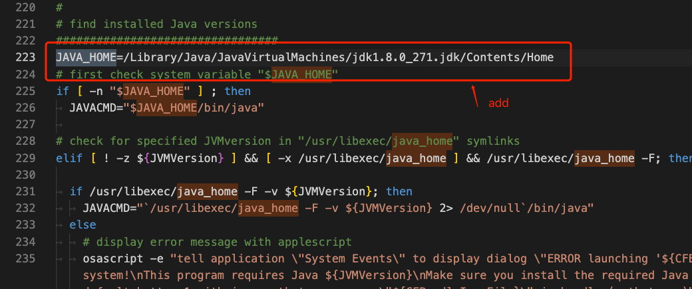

# toolbox
my toolbox for development，if not spec, in macOS

1. [use IntelliJ IDEA in command](https://www.jetbrains.com/help/idea/working-with-the-ide-features-from-command-line.html)

	> in macOS put scripts/idea in /usr/local/bin, then use idea in command
	more see document

2. Chrome下google翻译扩展不可用修正，参考如下文章。
	>@@开头的规则不走proxy

	将如下加入pac文件并删除已经存在的@@开头的rule
	```
	||translate.google.com
	||translate.googleapis.com
	||*.googleapis.com
	```
	 https://github.com/yanue/V2rayU/issues/874  
	 https://www.v2ex.com/t/890038#reply13	
   	
3. [JD-GUI](http://java-decompiler.github.io/) java反编译工具设置启动jdk版本  
  修改universalJavaApplicationStub.sh中的JAVA_HOME 
	```
	JAVA_HOME=/Library/Java/JavaVirtualMachines/jdk1.8.0_271.jdk/Contents/Home
	``` 
	
	universalJavaApplicationStub.sh文件路径： [your directory]/JD-GUI.app/Contents/MacOS

	> reference: https://sqiang.net/post/2524245389.html